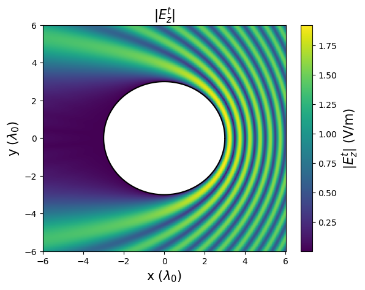
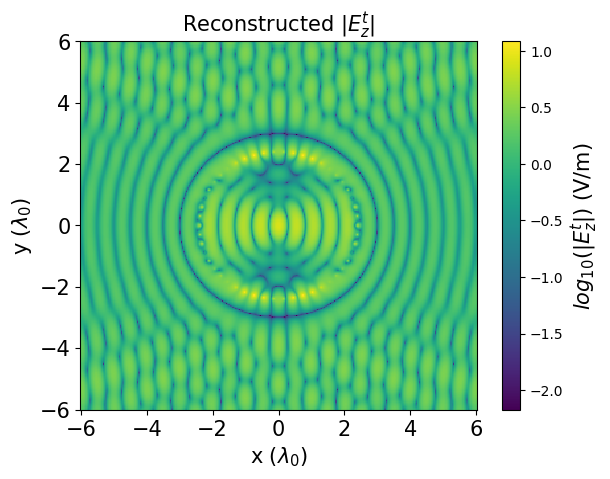

# Advanced-EM

## Project discription
The aim of this project is to formulate, implement and test an inverse scattering solver that receives the measured scattered field as input and generates an image of the total electric field strength in the vicinity of the unknown scattering object as output. For highly conductive scatterers, this image can be used to estimate the shape of the object. We consider the scattering of TMz time-harmonic waves from perfectly electrically conducting (PEC) scatterers in the second dimension. The core of the calculations is a Galerkin method (Method of Moments, MoM). 

## Forward scattering
The input to the forward solver is the incident field, the PEC scattering limit $\partial \Omega$ and the trace $\Gamma$, while the output of the forward solver is the calculated intensity of the scattered electric field at $\Gamma$. In our case, we construct the forward solver using a Galerkin MoM with Dirac delta sources and point matching.

  

$$E^{sca}(x) \approx \frac{\mu_0\omega}{4} \sum_{l = 1}^N H_0^{(2)}(k_0|\mathbf{x}- \mathbf{x'_l}|)J_z(\mathbf{x'_l})$$

$$\sum_{l = 1}^N c_l H_0^{(2)}(k_0|\mathbf{x_m}- \mathbf{x'_l}|) = - E^{inc}(\mathbf{x_m})$$

## Inverse scattering
In the inverse scattering problem, akin to the forward scattering problem, the current distribution is satisfying the observed electrical field
$\left.E(\mathbf{x})\right|_\Gamma$ along the observation curve $\Gamma$:
$$B.C. \approx E(\mathbf{x_m}) = E^{inc}(\mathbf{x_m}) + E^{sca}(\mathbf{x_m}) \; \forall \mathbf{x_m} \in \Gamma : m = 1,...,M'.$$

Discretizing the observation curve into $M'$ points:

$$B.C. \approx E(\mathbf{x_m}) = E^{inc}(\mathbf{x_m}) + E^{sca}(\mathbf{x_m}) \; \forall \mathbf{x_m} \in \Gamma : m = 1,...,M'.$$

Discretizing the scattered electrical field sources into $N'$ points, we obtain:

$$ E(\mathbf{x_m}) - E_{inc}(\mathbf{x_m}) = \sum_{l = 1}^{N'} H_0^{(2)}(k_0|\mathbf{x_m}-\mathbf{x'_l}|)c_l.$$

This can be translated into a matrix-vector form using identical $\mathbf{A}$ and $\mathbf{y}$ expressions with:
$$b_m = E(\mathbf{x_m}) - E_{inc}(\mathbf{x_m}).$$

## Results
The results of the forward scattering and inverse scattering are shown in the following figures. The forward scattering generates synthetic data, while the inverse scattering solves the inverse problem and reconstructs the shape of the scatterer.

### Forward scattering with a plane wave:

### Forward scattering with a point source:

### Inverse scattering with a plane wave:

## References

[1] Karamehmedović, M., Sørensen, M.P., Hansen, P.E., Lavrinenko, A. (2010). Application of the Method of Auxiliary Sources in Optical Diffraction Microscopy. In: Fitt, A., Norbury, J., Ockendon, H., Wilson, E. (eds) Progress in Industrial Mathematics at ECMI 2008. Mathematics in Industry(), vol 15. Springer, Berlin, Heidelberg.

[2] Karamehmedovic, Mirza & Hansen, Poul-Erik & Wriedt, Thomas. (2011). An efficient scattering model for PEC and penetrable nanowires on a dielectric substrate. J. Europ. Opt. Soc. Rap. Public.. 6. 11021. 10.2971/jeos.2011.11021. 

[3] Balanis C. A. (2012). Advanced Engineering Electromagnetics, 3rd Edition. John Wiley & Sons.

